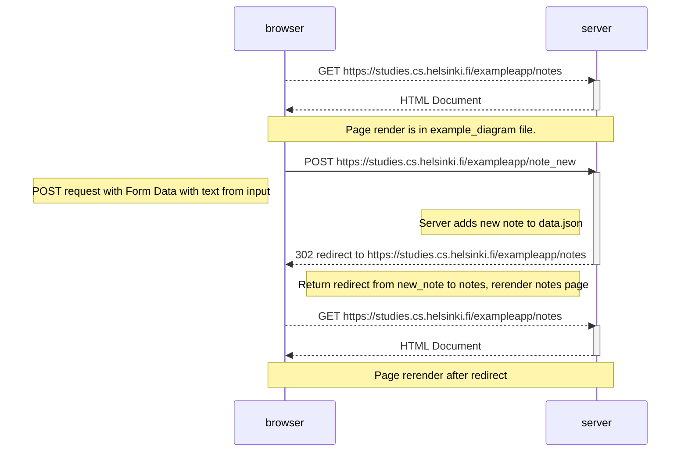

```mermaid
sequenceDiagram
    participant browser
    participant server

    browser-->>server: GET https://studies.cs.helsinki.fi/exampleapp/notes
    activate server
    server-->>browser: HTML Document
    deactivate server
    Note over browser,server: Page render is in example_diagram file.

    browser->>server: POST https://studies.cs.helsinki.fi/exampleapp/note_new
    activate server

    Note left of browser: POST request with Form Data with text from input
    Note left of server: Server adds new note to data.json

    server-->>browser: 302 redirect to https://studies.cs.helsinki.fi/exampleapp/notes
    deactivate server
    Note left of server: Return redirect from new_note to notes, rerender notes page

    browser-->>server: GET https://studies.cs.helsinki.fi/exampleapp/notes
    activate server
    server-->>browser: HTML Document
    deactivate server
    Note over browser,server: Page rerender after redirect
```