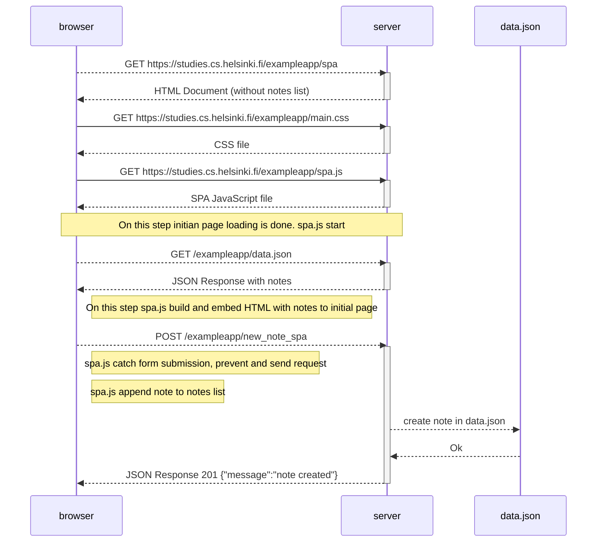

```mermaid
sequenceDiagram
    participant browser
    participant server
    participant data.json

    browser-->>server: GET https://studies.cs.helsinki.fi/exampleapp/spa
    activate server
    server-->>browser: HTML Document (without notes list)
    deactivate server

    browser->>server: GET https://studies.cs.helsinki.fi/exampleapp/main.css
    activate server
    server-->>browser: CSS file
    deactivate server

    browser->>server: GET https://studies.cs.helsinki.fi/exampleapp/spa.js
    activate server
    server-->>browser: SPA JavaScript file
    deactivate server
    Note over browser,server: On this step initian page loading is done. spa.js start

    browser-->>server: GET /exampleapp/data.json
    activate server
    server-->>browser: JSON Response with notes 
    deactivate server
    Note right of browser: On this step spa.js build and embed HTML with notes to initial page

    browser-->>server: POST /exampleapp/new_note_spa
    activate server
    Note right of browser: spa.js catch form submission, prevent and send request
    Note right of browser: spa.js append note to notes list
    server-->>data.json: create note in data.json
    data.json-->>server: Ok
    server-->>browser: JSON Response 201 {"message":"note created"}
    deactivate server

```